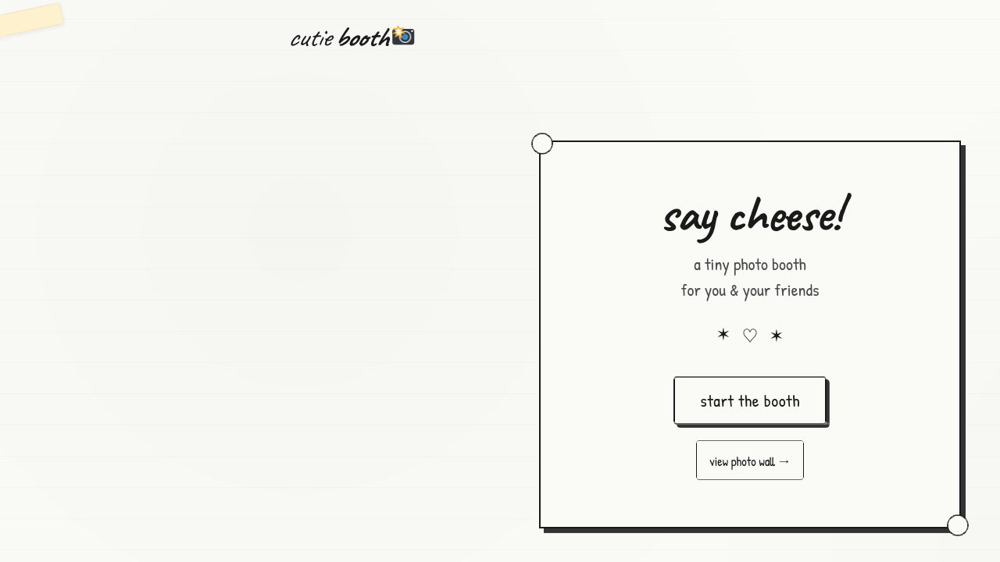
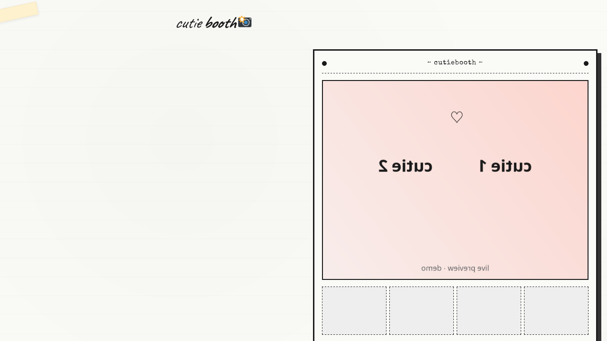
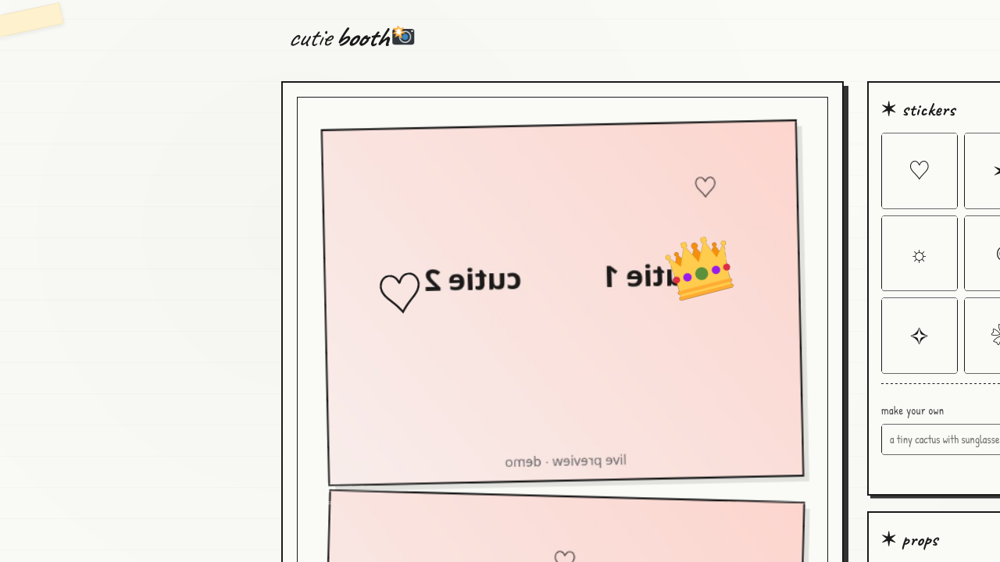
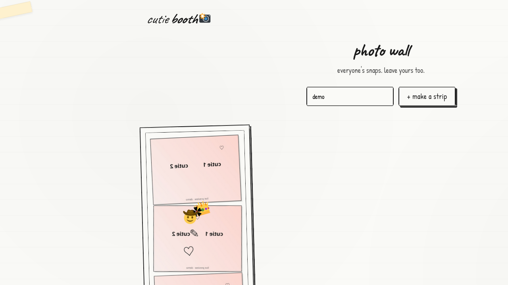

# cutiebooth 📸

a tiny, cutesy web-based photo booth. take photo strips, drag stickers and props on them, generate AI stickers with a prompt, and share on a public wall.

## screenshots

| welcome | camera | editor | photo wall |
|---|---|---|---|
|  |  |  |  |

## features

- **camera booth** with 1/3/4 shot strips, countdown, flash
- **AI sticker generation** via [Pollinations.ai](https://pollinations.ai/) (free, no API key) — type a prompt and get hand-drawn doodle stickers
- **drag & drop stickers and props** anywhere on your strip (mouse + touch)
- **photo wall** — post your strip to a public wall (localStorage backed)
- **save to PNG** — download the final composited strip
- **minimalist paper aesthetic** — white background, black ink, hand-drawn doodles, masking tape

## tech

- vanilla HTML / CSS / JS — no build step, no framework
- camera: `getUserMedia` + canvas
- AI gen: Pollinations.ai image endpoint
- persistence: `localStorage`

## run locally

```bash
# any static server works. e.g.:
python3 -m http.server 8000
# then open http://localhost:8000
```

camera requires HTTPS or localhost.

## file layout

```
cutiebooth/
├── index.html   # markup + screens
├── style.css    # paper / sketch aesthetic
├── app.js       # camera, editor, AI gen, wall
└── README.md
```

## license

MIT
